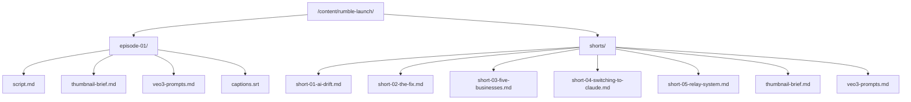

# Design Document: Rumble Launch Content

## Overview

This design specifies the implementation of the content production asset structure for "The Claude Chronicles" Rumble launch. The system is a set of static markdown and .srt files organized within `/content/rumble-launch/` — no application code, UI, or infrastructure changes are involved.

The deliverable is a deterministic file tree containing:
- 1 long-form Episode 1 production package (script, thumbnail brief, VEO 3 prompts, captions scaffold)
- 5 short-form clip scripts with shared thumbnail brief and VEO 3 prompts
- All committed to branch `ops/rumble-launch-v1`

### Design Decisions

| Decision | Rationale |
|----------|-----------|
| All files are markdown (.md) except captions (.srt) | Markdown is human-readable, git-diffable, and requires no tooling |
| Single VEO 3 prompts file per folder (not per-scene files) | Keeps related prompts co-located for easy iteration; sections within the file map to scenes |
| Shared thumbnail brief for shorts (not per-short files) | Enforces visual consistency and reduces duplication; per-short sections within one file |
| Placeholder timestamps in .srt | Captions structure is finalized post-voiceover; scaffolding establishes block count and text segmentation early |
| Self-contained short scripts | Each short can be sent to any producer independently without cross-referencing |

## Architecture

The architecture is a flat file tree with two subdirectories. There is no runtime component, no build step, and no dependency on the application stack.



### Isolation Guarantees

- No files outside `/content/rumble-launch/` are created or modified
- No imports, exports, or references to `/app/`, `/components/`, `/lib/`, or any application code
- No `package.json` changes, no new dependencies
- Branch `ops/rumble-launch-v1` only — no merge to main without CEO approval

## Components and Interfaces

Since this feature produces static content files (not code), "components" refers to the document structures and their relationships.

### Component 1: Episode Script (`episode-01/script.md`)

**Structure:**

```markdown
# Episode 1: I Lost Weeks Of Work Because AI Forgot Everything — So I Built My Own System

## Metadata
- Series: The Claude Chronicles
- Episode: 01
- Target Duration: 8–12 minutes
- Handle: @mysterycartel

## ElevenLabs Direction
- Voice: [voice name]
- Pacing: Conversational, slow on key points
- Tone: Calm, direct, confident
- Accent: West Palm Beach, Caribbean-American

## CapCut Specs
- Duration: 8–12 min (480–720 sec)
- Transitions: [style between scenes]
- Lower-thirds: [text format]
- End Card: [specifications]

## Script

### Scene 1 — [Title] [00:00]
*[Visual direction: Trading Chef avatar...]*

[Spoken dialogue...]

### Scene 2 — [Title] [~02:00]
...

(minimum 5 scenes)
```

**Constraints:**
- 1600–2400 words of spoken dialogue
- Minimum 5 numbered scenes with timestamps
- Topics covered: AI memory loss, canon anchors, session state, relay agent architecture
- `@mysterycartel` referenced in intro and outro
- Trading Chef avatar referenced in scene direction

### Component 2: Episode Thumbnail Brief (`episode-01/thumbnail-brief.md`)

**Structure:**

```markdown
# Episode 1 Thumbnail Brief

## Dimensions
- Canvas: 1280 × 720 px
- Safe Zone: 90% (1152 × 648 px effective)

## Avatar Placement
- Position: [left/right/center quadrant]
- Height: [50%–80%] of canvas height

## Text Overlay
- Hook Text: "[exact hook text]"
- Font: Bebas Neue (headline), Space Mono (secondary)
- Weight: Bold
- Minimum Size: [readable at 200×112 render]

## Color Assignment
- Background: [Brand_Color + treatment]
- Text: [Brand_Color]
- Accent: [Brand_Color]

## Background Composition
- Treatment: [solid/gradient/scene imagery]
- Description: [details]

## Emotional Tone & Visual Hook
- Target Emotions: [1–3 emotions]
- Primary Contrast: [color/scale/expression]
```

**Constraints:**
- Only Brand_Colors (Black #060608, Gold #C9A84C, Red, Green, Fire Orange)
- Avatar: 50%–80% canvas height
- All text/visuals within 90% safe zone

### Component 3: Episode VEO 3 Prompts (`episode-01/veo3-prompts.md`)

**Structure:**

```markdown
# Episode 1 — VEO 3 Video Generation Prompts

## Scene 1: [Title]
- Aspect Ratio: 16:9
- Target Duration: [X seconds]
- Camera: [named movement]
- Lighting: [descriptor]
- Style: [animation style]

[50–200 word prompt describing visuals, Trading Chef avatar details, Brand_Colors, environment]

## Scene 2: [Title]
...
```

**Constraints:**
- One prompt per scene (matching script scene numbers)
- 50–200 words per prompt
- Each prompt specifies: camera movement, lighting, animation style
- 16:9 aspect ratio + target duration in seconds
- Trading Chef scenes: describe avatar pose, expression, environment
- Non-avatar scenes: describe primary subject, environment, text/graphics

### Component 4: Episode Captions Scaffold (`episode-01/captions.srt`)

**Structure:**

```srt
1
00:00:00,000 --> 00:00:00,000
[First spoken sentence/phrase,
max 42 chars per line]

2
00:00:00,000 --> 00:00:00,000
[Next sentence/phrase]

...
```

**Constraints:**
- SubRip (.srt) format: sequential ID → timestamp → text → blank line
- All timestamps placeholder `00:00:00,000 --> 00:00:00,000`
- Max 42 characters per line, max 2 lines per block
- One block per spoken sentence/phrase (excludes stage directions, ElevenLabs notes, CapCut specs)
- Same scene order as script

### Component 5: Short-Form Scripts (`shorts/short-0X-*.md`)

**Structure:**

```markdown
# Short [XX]: [Topic Title]

## Metadata
- Series: The Claude Chronicles — Shorts
- Short: [01–05]
- Target Duration: 45–90 seconds
- Aspect Ratio: 9:16
- Handle: @mysterycartel

## ElevenLabs Direction
- Voice: [voice name]
- Pacing: [descriptor]
- Tone: [descriptor]

## CapCut Specs
- Aspect Ratio: 9:16
- Duration: [target seconds]
- Edit Cues:
  - [00:XX] — [cut/transition type]
  - [00:XX] — [cut/transition type]
  - [00:XX] — [cut/transition type]

## Script

[Hook line — first sentence, grabs attention]

[Remaining spoken dialogue...]

## Visual Direction
[Notes for on-screen visuals, Trading Chef presence, environment]
```

**Constraints:**
- 110–225 words spoken dialogue (45–90 sec runtime)
- Hook line as first sentence of script body
- At least 3 timestamped edit cues in CapCut Specs
- `@mysterycartel` referenced at least once
- Self-contained (all info needed to produce the short is in the file)

### Component 6: Shorts Thumbnail Brief (`shorts/thumbnail-brief.md`)

**Structure:**

```markdown
# Shorts Thumbnail Brief — The Claude Chronicles

## Shared Template
- Dimensions: 1280 × 720 px
- Font: Bebas Neue (hook text)
- Avatar Size: [small/medium/large]
- Background Treatment: [description]
- Colors: Brand_Colors only

## Short 01: AI Drift
- Hook Text: "[max 6 words]"
- Text Position: [top/center/bottom]
- Avatar Position: [left/right/center]
- Avatar Size: [small/medium/large]

## Short 02: The Fix
...

## Short 03: Five Businesses
...

## Short 04: Switching to Claude
...

## Short 05: Relay System
...
```

**Constraints:**
- Hook text max 6 words per short (flag if exceeded)
- Only Brand_Colors
- Shared layout template (font, avatar size, background) with only hook text and background image varying
- 1280×720 px dimensions

### Component 7: Shorts VEO 3 Prompts (`shorts/veo3-prompts.md`)

**Structure:**

```markdown
# Shorts — VEO 3 Video Generation Prompts

## Short 01: AI Drift

### Scene 1
- Aspect Ratio: 9:16
- Duration: [X seconds]
- Camera: [movement]
- Lighting: [mood]
- Style: [animation style]

[Prompt text with Trading Chef details, Brand_Colors hex values...]

### Scene 2
...

## Short 02: The Fix
...
```

**Constraints:**
- Labeled section per short (matching script filenames)
- 2–5 scene prompts per short
- Brand_Colors by name AND hex value
- Camera movement, lighting mood, animation style per prompt
- Trading Chef: attire (chef hat, apron, gold chain), style (confident Black male, urban cartoon), environment

## Data Models

This feature creates no database records, API schemas, or runtime data structures. The "data models" are the file format specifications defined above in Components and Interfaces.

### File Naming Convention

| Location | Filename | Format |
|----------|----------|--------|
| `/content/rumble-launch/episode-01/` | `script.md` | Markdown |
| `/content/rumble-launch/episode-01/` | `thumbnail-brief.md` | Markdown |
| `/content/rumble-launch/episode-01/` | `veo3-prompts.md` | Markdown |
| `/content/rumble-launch/episode-01/` | `captions.srt` | SubRip |
| `/content/rumble-launch/shorts/` | `short-01-ai-drift.md` | Markdown |
| `/content/rumble-launch/shorts/` | `short-02-the-fix.md` | Markdown |
| `/content/rumble-launch/shorts/` | `short-03-five-businesses.md` | Markdown |
| `/content/rumble-launch/shorts/` | `short-04-switching-to-claude.md` | Markdown |
| `/content/rumble-launch/shorts/` | `short-05-relay-system.md` | Markdown |
| `/content/rumble-launch/shorts/` | `thumbnail-brief.md` | Markdown |
| `/content/rumble-launch/shorts/` | `veo3-prompts.md` | Markdown |

### Brand Constants (Referenced Across All Files)

```yaml
Handle: "@mysterycartel"
Brand_Name: "MysterMyself"
Avatar_Name: "Trading Chef"
Avatar_Attributes:
  - Chef hat
  - Apron
  - Gold chain
  - Glasses
  - Confident Black male
  - Urban cartoon style
Colors:
  Black: "#060608"
  Gold: "#C9A84C"
  Red: (brand red — no specific hex locked)
  Green: (brand green — no specific hex locked)
  Fire_Orange: (brand fire orange — no specific hex locked)
Typography:
  Display: "Bebas Neue"
  Data: "Space Mono"
```

## Error Handling

Since this feature produces static files with no runtime behavior, "error handling" maps to content validation rules applied during authoring and review.

| Validation Rule | Action If Violated |
|-----------------|-------------------|
| Script word count outside 1600–2400 (episode) or 110–225 (short) | Revise script length before commit |
| Fewer than 5 scenes in episode script | Add scenes to meet minimum |
| Caption line exceeds 42 characters | Break line at nearest word boundary |
| Hook text exceeds 6 words in shorts thumbnail | Flag entry for revision per Req 7.7 |
| Brand_Color not from approved palette | Replace with nearest approved color |
| `@mysterymyself` used anywhere | Replace with `@mysterycartel` |
| File placed outside `/content/rumble-launch/` tree | Move to correct location |
| Missing ElevenLabs Direction or CapCut Specs section | Add required section before commit |
| VEO 3 prompt missing camera/lighting/style | Add missing specification |
| Short script references external files | Inline all required content |

### Commit Validation

Before committing to `ops/rumble-launch-v1`:
1. Verify all 11 files exist at correct paths
2. Verify no files modified outside `/content/rumble-launch/`
3. Verify commit message uses category prefix (e.g., `content: add episode 1 script`)
4. Verify no merge to main attempted

## Correctness Properties

### Property 1: File Completeness

All 11 specified production asset files exist at their designated paths within `/content/rumble-launch/`. The episode folder contains exactly 4 files (script.md, thumbnail-brief.md, veo3-prompts.md, captions.srt) and the shorts folder contains exactly 7 files (5 short scripts, thumbnail-brief.md, veo3-prompts.md). No files exist outside this tree.

**Validates: Requirements 1.1, 1.2, 1.3, 1.4, 1.5, 1.7**

### Property 2: Word Count Bounds

The episode script contains between 1600 and 2400 words of spoken dialogue (targeting 8–12 minutes). Each short-form script contains between 110 and 225 words of spoken dialogue (targeting 45–90 seconds). Word counts exclude metadata, section headers, and production notes.

**Validates: Requirements 2.3, 6.6**

### Property 3: Caption Format Compliance

The captions.srt file follows SubRip format with sequential integer IDs starting at 1, placeholder timestamps (`00:00:00,000 --> 00:00:00,000`), caption text lines of at most 42 characters, at most 2 lines per block, and blank line separators between blocks.

**Validates: Requirements 5.2, 5.3, 5.5, 5.6**

### Property 4: Brand Integrity

All files reference the handle as `@mysterycartel` only (never `@mysterymyself`). All visual specification files reference only approved Brand_Colors (Black #060608, Gold #C9A84C, Red, Green, Fire Orange). All avatar descriptions include: chef hat, apron, gold chain, and urban cartoon style.

**Validates: Requirements 10.1, 10.2, 10.3, 10.4, 10.5**

### Property 5: Isolation

No files are created or modified outside of `/content/rumble-launch/` or its subdirectories. No application code, UI components, configuration files, or package dependencies are touched. All commits target branch `ops/rumble-launch-v1` only.

**Validates: Requirements 9.1, 9.3, 9.4**

### Property 6: Self-Containment

Each short-form script includes all spoken lines, visual direction notes, ElevenLabs Direction, CapCut Specs, and production metadata required to produce the short independently — without referencing other script files or external documents.

**Validates: Requirements 6.8, 6.9, 6.11**

## Testing Strategy

### Why Property-Based Testing Does Not Apply

This feature creates static content files (markdown and .srt). There are no:
- Pure functions with input/output behavior
- Parsers, serializers, or data transformations
- Algorithms or business logic
- Universal properties that hold across a wide input space

The acceptance criteria are structural/content checks (file exists, file contains required sections, word counts in range). These are best validated through example-based checks and manual review.

### Validation Approach

**Automated Checks (CI-compatible shell scripts or manual verification):**

1. **File existence check** — Verify all 11 files exist at their specified paths
2. **Word count check** — Verify `script.md` is 1600–2400 words; each short is 110–225 words
3. **Section presence check** — Grep for required section headers (ElevenLabs Direction, CapCut Specs, etc.)
4. **Handle check** — Grep all files for `@mysterycartel` presence; grep for `@mysterymyself` absence
5. **Brand name check** — Verify "MysterMyself" or "Trading Chef" used; no abbreviations
6. **Caption line length check** — Verify no line in `captions.srt` exceeds 42 characters
7. **SRT format check** — Verify sequential IDs, timestamp format, blank line separators
8. **Scene count check** — Verify minimum 5 scenes in episode script
9. **Color reference check** — Verify only approved Brand_Colors referenced in visual files

**Manual Review (CEO approval required):**

1. Script quality — Voice, tone, narrative arc, brand alignment
2. Thumbnail briefs — Visual composition, emotional tone, click-through potential
3. VEO 3 prompts — Scene accuracy, avatar consistency, visual continuity
4. Content accuracy — Technical claims about canon anchors, relay agents, session state
5. Overall brand compliance — Trading Chef representation, handle usage, color adherence

### Acceptance Checklist

| Requirement | Validation Method |
|-------------|-------------------|
| Req 1: Folder structure | File existence check |
| Req 2: Episode script | Word count + section presence + handle check |
| Req 3: Episode thumbnail | Color check + section presence |
| Req 4: Episode VEO 3 | Scene count match + per-prompt specs check |
| Req 5: Captions scaffold | SRT format + line length + block count |
| Req 6: Short scripts | Word count + hook position + self-containment |
| Req 7: Shorts thumbnail | Hook word count + color check + template consistency |
| Req 8: Shorts VEO 3 | Section labels + prompt count + color hex presence |
| Req 9: Branch standards | Git branch name + commit prefix + no-merge check |
| Req 10: Brand compliance | Handle + name + color + avatar attribute checks |
